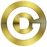

# Welcome to the DeroGold Wiki 

This wiki is the main source of documentation for newcomers to the DeroGold project. If this is your first time hearing about DeroGold, check out the [DeroGold website](https://derogold.com/).

## What is DeroGold?

DeroGold is a digital assets project focused on preserving our life environment here on Earth. 

DeroGold aspires to solve problems such as circular economy in recycling, re-use of waste materials and how we can drive positive behaviour by rewarding people with digital assets for recycling. And build sustainable, carbon-negative buildings using Ferrock.

For simplicity, we say we are the digital "Nectar Card for Recycling".

However, we are much more than that. We run our own privacy digital asset that allows people and organisations to send and receive our native digital coins called DEGO.

## Quick Navigation

| **About DeroGold** | **Wallets** | **Mining** | **Contributing** |
|:----------------------:|:-------------:|:------------:|:------------------:|
|  |  |  |  |
| [About DeroGold](about/About-TurtleCoin) | [Setting up a New Wallet](Getting-Started#new-wallet) | [Mining DeroGold](Getting-Started#mining) | [Contributing to DeroGold](about/Contributing) |
| Learn more about DeroGold and the community | A guide on setting up a DeroGold wallet to start receiving some DEGO! | A step-by-step guide to start mining DeroGold | Information on contributing to DeroGold

## Have Questions or Need Help?

Check out our [Discord](https://discord.com/invite/j2aSNFn) to get in touch.

Other than that, check and subscribe to our [Youtube](https://www.youtube.com/@DeroGold/videos) DeroGold vlog.

